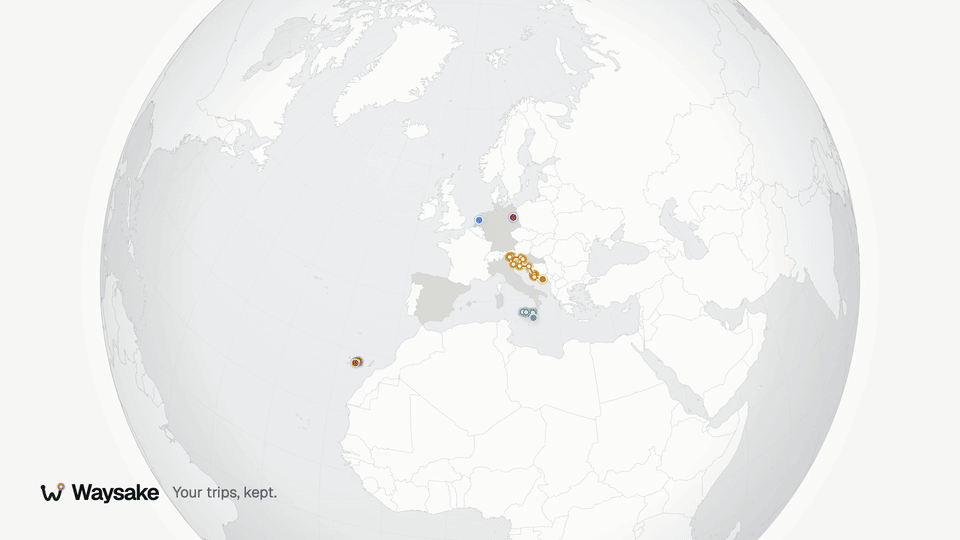
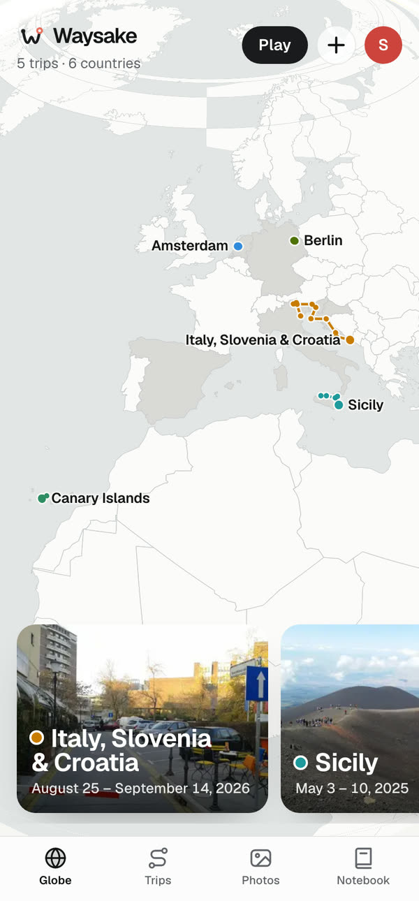
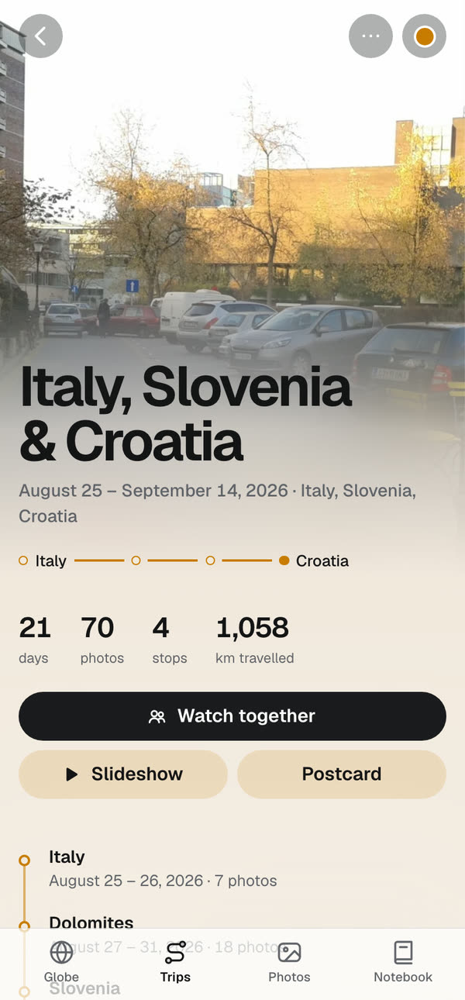
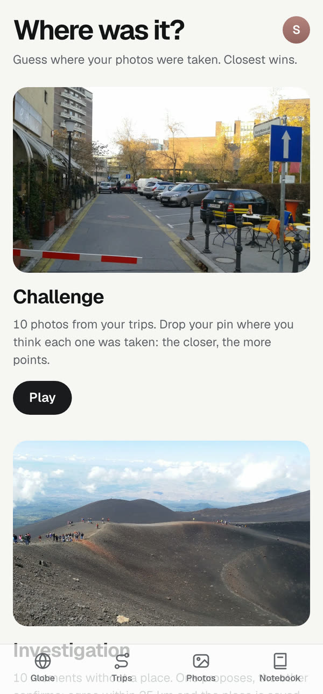

<p align="right"><b>English</b> · <a href="README.fr.md">Français</a></p>

<p align="center">
  <picture>
    <source media="(prefers-color-scheme: dark)" srcset="docs/design/assets/logo-glyph-dark.svg">
    
  </picture>
</p>

<h1 align="center">Waysake</h1>

<p align="center"><b>Your trips, kept.</b></p>

<p align="center"><i>Immich organizes your photos. Waysake keeps the journey.</i></p>

<p align="center">
  <a href="https://github.com/Mariusfaitducode/waysake/releases/download/v0.2.0/waysake-demo.mp4">
    
  </a>
</p>

<p align="center">
  <a href="https://github.com/Mariusfaitducode/waysake/releases/download/v0.2.0/waysake-demo.mp4"><b>▶ Watch the 50-second demo</b></a>
</p>

Waysake is a self-hosted travel drive for a couple or a family. You send it your photos; it sorts them into
trips and stops on a globe, with the route, the countries you discovered and your notes. It runs on a computer
at home, in one Docker container. No cloud, no account.

We built it for the two of us, to look back at our trips the way we lived them: in order, place by place.

<table>
  <tr>
    <td width="33%"></td>
    <td width="33%"></td>
    <td width="33%"></td>
  </tr>
</table>

## What it does

- **Trips found for you**: photos are grouped by date and place into trips and stops (offline geocoding); you confirm.
- **A globe of your journeys**: routes, visited countries, and a color for each trip.
- **Import from your phone**: the Android app sends a period or picked months and keeps the GPS of every photo.
- **“Where was it?”**: a game for two. Guess where a photo was taken, or agree on a place for photos that have none.
- **Watch together**: follow a trip's photos live on two phones, or play it as a slideshow.
- **Yours, at home**: originals never modified, household password, profiles instead of accounts, English and French.

## Quick start

You need [Docker](https://docs.docker.com/get-docker/).

```bash
mkdir waysake && cd waysake
curl -fsSLO https://raw.githubusercontent.com/Mariusfaitducode/waysake/main/docker-compose.yml
WAYSAKE_PROFILES="Alex, Sam" WAYSAKE_PASSWORD="choose-a-password" docker compose up -d
```

Then open `http://<your-computer>:8420`, pick your profile and add some photos. The image runs on PC, Mac,
Raspberry Pi and NAS (amd64 and arm64).

## Set it up with an AI assistant

If you use [Claude Code](https://claude.com/claude-code) or another coding agent, paste this prompt into it. It
will walk you through the installation on your own machine, one step at a time.

```text
Help me install Waysake, a self-hosted travel photo drive (https://github.com/Mariusfaitducode/waysake),
on this machine. Guide me step by step, explain each step in plain words before doing it, and wait for my
answer whenever you need a choice from me.

Rules:
- Ask for my confirmation before anything irreversible or system-wide: installing software, deleting or
  moving files, changing firewall or network settings, overwriting an existing file.
- Never expose Waysake to the public internet, and never without HTTPS. Private network or Tailscale only.
- Never print my password back in full, and do not commit it anywhere.

Steps:
1. Check that Docker and Docker Compose work (`docker compose version`). If not, tell me how to install
   Docker for my system and wait until I have done it.
2. Ask me where Waysake should keep its data (my photos, thumbnails and database). Suggest a folder on a disk
   with enough free space, and show me how much space is free there.
3. Ask me the first names of the people in my household (for WAYSAKE_PROFILES, e.g. "Alex, Sam") and a
   household password (WAYSAKE_PASSWORD).
4. Create a `waysake` folder. Download
   https://raw.githubusercontent.com/Mariusfaitducode/waysake/main/docker-compose.yml into it, and write a
   `.env` file next to it with WAYSAKE_DATA, WAYSAKE_PROFILES and WAYSAKE_PASSWORD. Restrict the `.env` file's
   permissions to my user.
5. Start it with `docker compose up -d`, then check `http://localhost:8420/api/health` until it answers
   `"ok":true`. If it doesn't, read `docker compose logs` and help me fix it.
6. Ask whether I want to reach Waysake from our phones. If yes, offer Tailscale: help me install it, then run
   `tailscale serve --bg 8420` and `tailscale serve status` to get the private https address.
7. Explain the phones: on Android, the Waysake app (downloadable from `<address>/app` once its APK is in
   `<data folder>/app/waysake.apk`) imports photos with their GPS; on iPhone, use Safari and
   "Add to Home Screen".
8. Explain backups: Waysake keeps 7 daily snapshots of its database in `<data folder>/backups`, but one copy of
   the photos is not a backup. Help me plan a copy of the whole data folder to another disk.
9. Offer automatic updates. On Linux or a NAS: Watchtower watching the `atlas` container. Otherwise: show me
   `docker compose pull && docker compose up -d` and offer to schedule it.
10. Finish with a short summary: the address, where the data lives, how to update, how to stop it.
```

<details>
<summary><b>Configuration</b></summary>

Set these in the shell, or in a `.env` file next to `docker-compose.yml` so you don't have to type them again.

| Variable | Default | What it does |
|---|---|---|
| `WAYSAKE_DATA` | `./atlas-data` | Where photos and the database live, e.g. `/mnt/photos/waysake`, or `D:/Waysake` on Windows. |
| `WAYSAKE_PROFILES` | two sample profiles, Alex and Sam | The people in the household, with an optional color: `"Léa:#3E309F, Tom:#2F8ADC"`. A profile added later is created on restart. Profiles are never deleted, because photos are attached to them. |
| `WAYSAKE_PASSWORD` | none | The household password (see Security). Empty: anyone on the network can use Waysake. |

Waysake listens on port **8420** and restarts with the machine (`restart: unless-stopped`). The older `ATLAS_*`
names, from before the project was renamed, still work. To build the image yourself from a clone of the repo:
`docker compose up -d --build`.

</details>

<details>
<summary><b>On your phone</b></summary>

To reach Waysake from your phones, privately and over HTTPS, use [Tailscale](https://tailscale.com):

```bash
tailscale serve --bg 8420
tailscale serve status   # prints https://<machine>.<tailnet>.ts.net
```

- **Android**: build the APK (see Development) and put it in `<WAYSAKE_DATA>/app/waysake.apk`; it can then be
  downloaded from `https://<address>/app`. In the app, enter Waysake's address (and the password if there is one),
  pick your profile and allow **full** photo access: that is what keeps the locations. To import, choose a
  period (since the last import, the last 30 days, some dates, or month by month), then send.
- **iPhone**: use Waysake in Safari (*Share → Add to Home Screen*). iOS removes the GPS from photos uploaded
  through the browser; those photos land in *To locate*, where you can place a whole day or moment at once.

After every import, Waysake proposes the trips and stops, sets aside screenshots and photos taken at home, and
you confirm.

</details>

<details>
<summary><b>Backups</b></summary>

Everything is in the `WAYSAKE_DATA` folder: the originals (never modified), the thumbnails and the SQLite database.

- **Every day**, Waysake takes a snapshot of its database in `WAYSAKE_DATA/backups` and keeps the last 7. That
  protects your notes, places and titles from a mistake, not from a disk failure.
- **On another disk**: one copy of your photos is no copy. Copy the whole data folder to an external drive or
  your usual backup tool. For a Windows tower, `scripts/install-backup.sh me@tower E:/` sets up a nightly copy
  to an external drive (nothing is ever deleted from the backup; log in `WAYSAKE_DATA\backup.log`).
- **Restore**: with Waysake stopped, copy the backup back into the data folder, then rename the latest
  `backups/atlas-YYYY-MM-DD.db` to `atlas.sqlite`.

</details>

<details>
<summary><b>Automatic updates</b></summary>

Every merge to `main` goes through CI: tests, types, build, then a smoke test of the Docker image (started on an
empty folder; health, site and API must answer). Only an image that passes everything is published as `:latest`.
Pull requests are tested the same way but never publish.

To update by hand: `docker compose pull && docker compose up -d`. To follow `:latest` automatically:

- **[Watchtower](https://containrrr.dev/watchtower/)** (any Linux machine, NAS…): simple, but no database
  backup and no rollback.
  ```bash
  docker run -d --name watchtower --restart unless-stopped -v /var/run/docker.sock:/var/run/docker.sock \
    containrrr/watchtower --cleanup --interval 300 atlas
  ```
- **Windows tower** (Docker Desktop): `scripts/install-autoupdate.sh me@tower C:/Atlas` installs a scheduled
  task. Every 2 minutes it checks for a new image; when there is one, it backs up the database, replaces the
  container, checks its health and **rolls back** if something is wrong. `--status` shows its state, `--off`
  turns it off.

Why the server pulls the image instead of GitHub pushing a deployment: on a public repository, a self-hosted
GitHub Actions runner would run code from any fork's pull request on your machine. Your server exposes nothing
and only downloads an image that has already passed CI. `/api/health` shows which version is running.

</details>

<details>
<summary><b>Security</b></summary>

- Set a **household password** with `WAYSAKE_PASSWORD` (recommended). The whole API and every photo then ask for
  it, once per device (one-year session; the Android app keeps it). Changing the password signs out every device.
  After that, each person just picks their profile: there are no accounts. A client without a browser (a
  script, a shortcut) sends `Authorization: Bearer <password>`.
- Waysake is made for a private network: your Wi-Fi, or Tailscale from your phones. **Do not expose it directly
  to the internet**, and never without HTTPS: the password would travel in clear text.
- No telemetry. The only outbound requests are map tiles for the trip maps ([OpenFreeMap](https://openfreemap.org/)).

Found a security issue? Please open a private
[security advisory](https://github.com/Mariusfaitducode/waysake/security/advisories/new) rather than a public issue.

</details>

<details>
<summary><b>Development</b></summary>

```bash
pnpm install
pnpm seed      # demo data
pnpm dev       # API on :8420, web on :5173
pnpm test
```

Stack: Node, TypeScript, Fastify, SQLite (better-sqlite3), React, Vite, MapLibre; ffmpeg for videos.

Android app: `apps/mobile` (Expo). For a signed APK, create your key, then build:

```bash
keytool -genkeypair -v -keystore ~/.atlas/atlas-release.keystore -alias atlas \
  -keyalg RSA -keysize 2048 -validity 10000
ATLAS_STORE_PASSWORD=... apps/mobile/scripts/build-apk.sh
```

Coming soon: reading your existing [Immich](https://immich.app) library, so your photos don't have to be uploaded twice.

</details>

<details>
<summary><b>How it's built</b></summary>

Waysake is developed with the coding assistant [Claude Code](https://claude.com/claude-code): most commits are
co-signed by Claude. It is not generated code left on its own. I use Waysake with my partner, and I read and test
every change on our own photo library. The server is covered by more than 200 automated tests, and sensitive
changes (authentication, import, files) go through a dedicated security review. Issues and criticism are welcome.

</details>

<details>
<summary><b>License and credits</b></summary>

[AGPL-3.0-or-later](LICENSE). You can use, modify and share Waysake freely; if you host a modified version for
other people, you must publish its source code.

- Demo photos: free-licensed photos from Wikimedia Commons and Flickr, credited in
  [docs/demo-photos.md](docs/demo-photos.md). `pnpm seed` downloads them once into `~/.cache/waysake-demo/`.
- Place data: [GeoNames](https://www.geonames.org/) (CC BY 4.0) and [Natural Earth](https://www.naturalearthdata.com/) (via [world-atlas](https://github.com/topojson/world-atlas)).
- Map tiles: [OpenFreeMap](https://openfreemap.org/), © [OpenStreetMap](https://www.openstreetmap.org/copyright) contributors.

</details>
